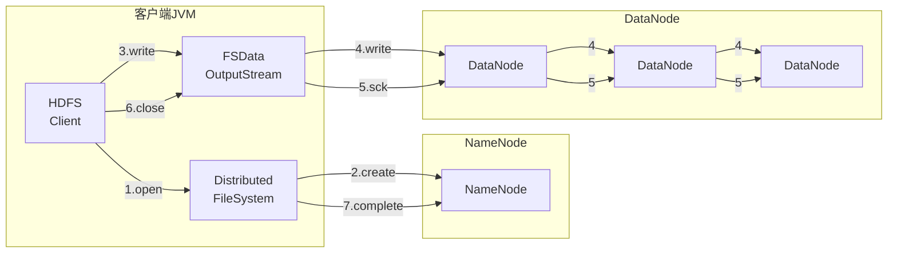

# HDFS简介

> **Hadoop Distributed File System**
>
> 源自于Google的GFS论文（发布于2003年10月）
>
> HDFS是GFS的克隆版


**Hadoop三大核心**

**`HDFS`、`MapReduce`、`YARN` **


**Hadoop四个模块**

- **Hadoop Common**

    为其他Hadoop模块提供支持的基础设施

- **Hadoop DFS**

    高可靠、高吞吐量的分布式文件系统

- **Hadoop MapReduce**

    分布式的离线并行计算框架

- **Hadoop YARN**

    集群资源管理与任务调度


## HDFS介绍

​	Hadoop分布式文件系统(HDFS)被设计成适合运行在通用硬件(commodity hardware)上的**`分布式文件系统`**。它和现有的分布式文件系统有很多共同点。但同时，它和其他的分布式文件系统的区别也是很明显的。HDFS是一个**`高度容错性`**的系统，适合部署在廉价的机器上。HDFS能提供**`高吞吐量`**的数据访问，非常适合大规模数据集上的应用。HDFS放宽了一部分POSIX约束，来实现流式读取文件系统数据的目的。HDFS在最开始是作为Apache Nutch搜索引擎项目的基础架构而开发的。HDFS是Apache Hadoop Core项目的一部分。


## HDFS设计目标

1. 存储量大
2. 自动快速检测应对硬件错误
3. 流式访问数据
4. 移动计算比移动数据本身更划算
5. 简单一致性模型（一次性写入多次读取）
6. 异构平台可移植（平台、框架）


## HDFS特点

### 优点

1. 高容错性
    - 数据自动保存多个副本。它通过增加副本的形式，提高容错性。
    - 某一个副本丢失以后，它可以自动恢复，这是由 HDFS 内部机制实现的，我们不必关心。

2. 适合批处理
    - 它是通过移动计算而不是移动数据。
    - 它会把数据位置暴露给计算框架。

3. 适合大数据处理
    - 数据规模：能够处理数据规模达到 GB、TB、甚至PB级别的数据。
    - 文件规模：能够处理百万规模以上的文件数量，数量相当之大。
    - 节点规模：能够处理10K节点的规模。

4. 流式数据访问
    -  一次写入，多次读取，不能修改，只能追加。
    -  它能保证数据的一致性。

5. 可构建在廉价机器上
    - 它通过多副本机制，提高可靠性。
    -  它提供了容错和恢复机制。比如某一个副本丢失，可以通过其它副本来恢复。

### 缺点

1.  不适合低延时数据访问；

    - 比如毫秒级的来存储数据，这是不行的，它做不到。

    -  它适合高吞吐率的场景，就是在某一时间内写入大量的数据。但是它在低延时的情况  下是不行的，比如毫秒级以内读取数据，这样它是很难做到的。

2. 无法高效的对大量小文件进行存储

    - 存储大量小文件的话，它会占用  NameNode大量的内存来存储文件、目录和块信息。这样是不可取的，因为NameNode的内存总是有限的。

    - 小文件存储的寻道时间会超过读取时间，它违反了HDFS的设计目标。 改进策略

3. 并发写入、文件随机修改

    - 一个文件只能有一个写，不允许多个线程同时写。

    - 仅支持数据 append（追加），不支持文件的随机修改。


## HDFS架构

> 1. NameNode
> 2. Secondary NameNode
> 3. DataNode


​	HDFS具有主/从架构。HDFS集群由单个NameNode，一个管理文件系统命名空间的主服务器和管理客户端对文件的访问组成。此外，还有许多DataNode，通常是群集中每个节点一个，用于管理连接到它们运行的节点的存储。HDFS公开文件系统命名空间，并允许用户数据存储在文件中。在内部，文件被分成一个或多个块，这些块存储在一组DataNode中。NameNode执行文件系统命名空间操作，如打开，关闭和重命名文件和目录。它还确定了块到DataNode的映射。DataNode负责提供来自文件系统客户端的读写请求。DataNodes还执行块创建，删除。

## HDFS写数据



1. 客户端向NameNode发出写文件请求。

2. 检查是否已存在文件、检查权限。若通过检查，直接先将操作写入EditLog，并返回输出流对象。

    （注：WAL，write ahead log，先写Log，再写内存，因为EditLog记录的是最新的HDFS客户端执行所有的写操作。如果后续真实写操作失败了，由于在真实写操作之前，操作就被写入EditLog中了，故EditLog中仍会有记录，我们不用担心后续client读不到相应的数据块，因为在第5步中DataNode收到块后会有一返回确认信息，若没写成功，发送端没收到确认信息，会一直重试，直到成功）

3. client端按128MB的块切分文件。

4. client将NameNode返回的分配的可写的DataNode列表和Data数据一同发送给最近的第一个DataNode节点，此后client端和NameNode分配的多个DataNode构成pipeline管道，client端向输出流对象中写数据。client每向第一个DataNode写入一个packet，这个packet便会直接在pipeline里传给第二个、第三个…DataNode。

    （注：并不是写好一个块或一整个文件后才向后分发）

5. 每个DataNode写完一个块后，会返回确认信息。 

    （注：并不是每写完一个packet后就返回确认信息，个人觉得因为packet中的每个chunk都携带校验信息，没必要每写一个就汇报一下，这样效率太慢。正确的做法是写完一个block块后，对校验信息进行汇总分析，就能得出是否有块写错的情况发生）

6. 写完数据，关闭输输出流。

7. 发送完成信号给NameNode。 

    （注：发送完成信号的时机取决于集群是强一致性还是最终一致性，强一致性则需要所有DataNode写完后才向NameNode汇报。最终一致性则其中任意一个DataNode写完后就能单独向NameNode汇报，HDFS一般情况下都是强调强一致性）

## HDFS读数据

```mermaid
graph LR
	subgraph 客户端JVM
		A[HDFS<br/>Client]
		B[Distributed<br/>FileSystem]
		C[FSData<br/>OutputStream]
    end
    subgraph NameNode
    D[NameNode]
    end
    subgraph DataNode
    E[DataNode]
    F[DataNode]
    G[DataNode]
    end
A-.1.open.->B
B-.2.get Block<br/>location.->D
A-.3.read.->C
C-.4.read.->E
C-.5.read.->G
A-.6.close.->C

```

1. client访问NameNode，查询元数据信息，获得这个文件的数据块位置列表，返回输入流对象。

2. 就近挑选一台datanode服务器，请求建立输入流 。

3. DataNode向输入流中中写数据，以packet为单位来校验。

4. 关闭输入流.

    